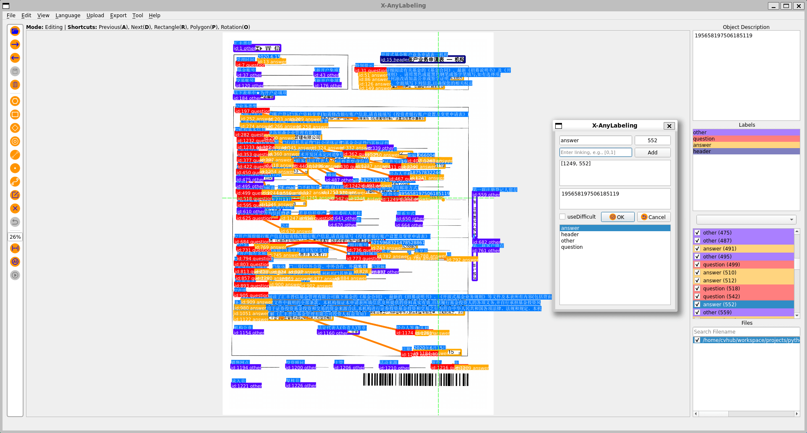

# Key Information Extraction Example

## Introduction

 

**Key Information Extraction (KIE)** involves extracting essential information from images, such as retrieving a name and ID number from an ID card. The type of information extracted is often specific to the task at hand but can vary across different tasks.

KIE is typically divided into two sub-tasks:
- **Semantic Entity Recognition (SER)**: Recognizes and classifies text within images.
- **Relation Extraction (RE)**: Categorizes detected text (e.g., distinguishing questions from answers) and identifies relationships, such as matching questions with their corresponding answers.

## Usage

### Semantic Entity Recognition

For the SER task, you can annotate text regions using the following three methods:

- **Rectangle (Shortcut: R)**: Draws rectangular shapes around text regions.
- **Rotation (Shortcut: O)**: Annotates text regions with a rotated shape.
- **Polygon (Shortcut: P)**: Allows for "four-point" or "irregular polygon" annotations.

After drawing the text boxes, fill in the following fields in the label editing dialog:
- `label`: The entity type, such as QUESTION, ANSWER, HEADER, or OTHER for the [XFUND](https://github.com/doc-analysis/XFUND) dataset.
- `description`: The specific text content.
- `difficult`: This field can be toggled via the `useDifficult` checkbox.

### Relation Extraction

 

For the RE task, in addition to the SER fields, you need to fill in two more fields:
- `group_id`: A unique identifier for each text box within an image.
- `linking`: Links questions to their corresponding answers, identified by `group_id`.

To modify any of these fields, use `Ctrl+E` to open the label manager and make adjustments in the pop-up dialog.

## Export

For instructions on exporting PP-OCR KIE annotations, please refer to the user guide:
- [English version](../../docs/en/user_guide.md)
- [Chinese version](../../docs/zh_cn/user_guide.md)

A complete example of the output can be found [here](./ppocr-kie/).

The exported annotations are suitable for training PP-OCR KIE tasks.
