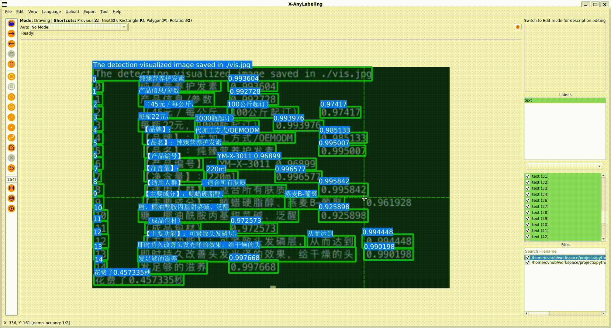

# Text Recognition Example

## Introduction

- **Text Detection**: Find the areas with text in the input image.
- **Text Recognition**: Understand the words in the image, usually from the images of text areas cut out from the text boxes detected.

## Usage

 

Currently, X-AnyLabeling supports both manual and automatic annotation of the PP-OCR dataset.

1. Manual Annotation Modes

The following modes are avaliable:
- **rectangle**: For drawing rectangle shape around text regions.
- **rotation**: For annotating text regions with a rotation shape.
- **polygon**: For "four-point" or "irregular polygon" annotation of text regions.

2. Automatic Annotation Mode

For automatic annotation, the tool is integrated with models from [PaddleOCR-v4.0](https://github.com/PaddlePaddle/PaddleOCR). Users can select the appropriate model based on their needs or deploy custom models for assisted inference. 

Here's how to proceed with automatic annotation:
- Load the image or video file.
- Load the relevant PPOCR model.
- Click to run the annotation process.

When annotating PPOCR data, the `label` field values can be ignored; instead, you should focus on the `description` field. 
- To hide the text labels, you can use the shortcut `Ctrl+L`. 
- To modify the `description` field, you can use `Ctrl+E` to open the label manager and make corrections in the section of the pop-up dialog.

## Export

For instructions on exporting PP-OCR Rec annotations, please consult the user guide available:
- [English version](../../docs/en/user_guide.md)
- [Chinese version](../../docs/zh_cn/user_guide.md)

The exported annotations can be directly used for the training of PP-OCR detection and recognition models.
